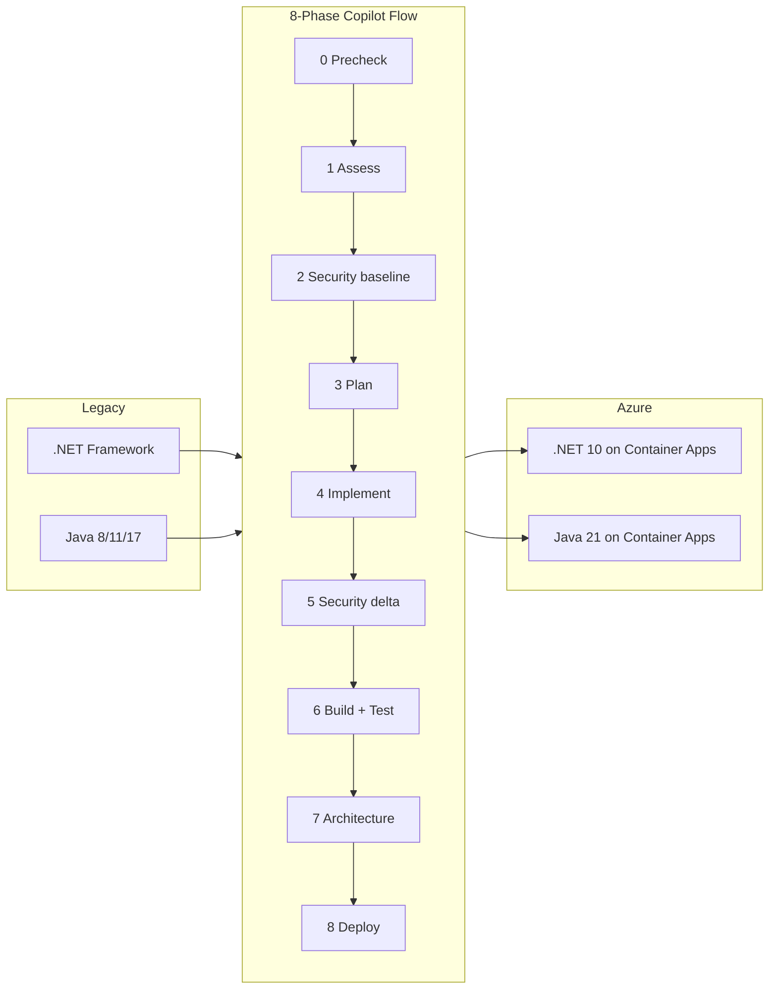

<!--
---
page_type: sample
languages:
  - csharp
  - java
  - bicep
  - bash
products:
  - azure
  - dotnet
  - aspnet-core
  - azure-container-apps
  - azure-app-service
  - azure-database-postgresql
  - github-copilot
name: App Modernization Lab — .NET and Java to Azure
description: Dual-stack app modernization lab for bundled samples or bring-your-own .NET and Java applications, driven by GitHub Copilot App Modernization flows to produce Azure-ready output.
urlFragment: app-modernization-lab
---
-->

# App Modernization Lab — .NET and Java

[](https://codespaces.new/Azure-Samples/app-modernization-lab?quickstart=1)
[](https://vscode.dev/redirect?url=vscode://ms-vscode-remote.remote-containers/cloneInVolume?url=https://github.com/Azure-Samples/app-modernization-lab)
[](LICENSE)

A **reusable, one-click** app modernization lab that upgrades legacy applications and re-platforms them onto Azure. You can run it against the bundled samples or point it at your own application. Two stacks are supported in the same repo:

| Stack | Source | Target | One-click command |
|---|---|---|---|
| **.NET** | .NET Framework 3.5 / 4.x (WebForms, MVC, WCF, EF6, Autofac, log4net) | .NET 10 (minimal hosting, EF Core, built-in DI, Serilog) | `/dotnet.modernize` |
| **Java** | JDK 8 / 11 / 17 (Spring Boot 1.x/2.x, Java EE, Ant/Maven) | Java 21 + Spring Boot 3.3 (Jakarta EE, OpenRewrite-applied) | `/java.modernize` |

Both flows share the **same 8-phase pipeline, same devcontainer, same evidence-doc contract** — only the toolchain differs.



---

## Two stacks, two ways to use each

| Mode | When | What you run |
|---|---|---|
| **Demo — .NET** | Workshops, first run | `/dotnet.modernize legacy/dotnet-eshop/eShopLegacyMVCSolution` |
| **Demo — Java** | Workshops, first run | `/java.modernize legacy/java-asset-manager` |
| **BYO — .NET** | Real customer code | Set `LEGACY_DOTNET_PATH` in `.env`, then `/dotnet.modernize` |
| **BYO — Java** | Real customer code | Set `LEGACY_JAVA_PATH` in `.env`, then `/java.modernize` |

All four use the same agents, same skills, same validation gates.

---

## Quickstart (5 minutes, zero local install)

1. Click **[Open in GitHub Codespaces](https://codespaces.new/Azure-Samples/app-modernization-lab?quickstart=1)**.
2. Wait ~3 minutes — the devcontainer installs .NET 10, Java 21, Docker, Azure CLI, and AppCAT.
3. Open **Copilot Chat** and run either:
   ```
   /dotnet.modernize          # uses bundled .NET sample
   /java.modernize            # uses bundled Java sample
   ```
4. Watch the agent execute Phases 0–8 and write evidence to `docs/dotnet/` or `docs/java/`.

---

## Local quickstart (Docker required)

```bash
# Clone and enter
git clone https://github.com/Azure-Samples/app-modernization-lab
cd app-modernization-lab

# Devcontainer (recommended — installs everything for you)
code .             # then "Reopen in Container"

# OR manual setup
cp .env.example .env
bash scripts/setup-local-env.sh
```

Then in Copilot Chat: `/dotnet.modernize` or `/java.modernize`.

---

## Bring your own codebase

To modernize **any customer .NET or Java app**, just point the env at it:

```bash
cp .env.example .env

# .NET
# Edit .env:
#   LEGACY_DOTNET_PATH='/path/to/customer/dotnet-source'
# Then in Copilot Chat:
/dotnet.modernize

# Java
# Edit .env:
#   LEGACY_JAVA_PATH='/path/to/customer/java-source'
# Then in Copilot Chat:
/java.modernize
```

The same flow works on any `.csproj`/`.sln` tree (.NET) or any `pom.xml`/`build.gradle` tree (Java).

---

## What's in the box

```
app-modernization-lab/
├── .devcontainer/                       # One-click Codespaces / dev container
│   ├── devcontainer.json                #   .NET 10 + Java 21 + Docker + Azure CLI
│   └── postCreate.sh                    #   AppCAT, OpenRewrite prep, sec-check
├── .github/
│   ├── agents/
│   │   ├── appmodernization-dotnet.agent.md   # .NET orchestration agent
│   │   ├── modernize-azure-java.agent.md      # Java orchestration agent
│   │   └── pm-migration-agent.md              # Optional PM/architect agent
│   ├── prompts/
│   │   ├── dotnet.modernize.prompt.md         # /dotnet.modernize one-click
│   │   └── java.modernize.prompt.md           # /java.modernize one-click
│   ├── skills/
│   │   ├── dotnet-modernization-flow/SKILL.md # .NET 8-phase pipeline
│   │   └── java-modernization-flow/SKILL.md   # Java 8-phase pipeline
│   ├── workflows/                             # CI: build + smoke tests
│   ├── ISSUE_TEMPLATE/
│   └── copilot-instructions.md                # Repo conventions for Copilot
├── legacy/
│   ├── dotnet-eshop/                          # .NET Framework eShopModernizing sample
│   └── java-asset-manager/                    # Java workshop sample (asset-manager)
├── modernized/
│   ├── dotnet-eshop/                          # .NET 10 output (generated by Phase 4)
│   └── java-asset-manager/                    # Java 21 + Spring Boot 3 output
├── docs/
│   ├── dotnet/                                # .NET phase evidence (01-08)
│   └── java/                                  # Java phase evidence (01-08)
├── scripts/
│   ├── setup-local-env.sh                     # Install missing tools locally
│   ├── run-modernization.sh                   # Headless wrapper (CI use)
│   ├── dotnet/                                # .NET-specific helpers
│   └── java/                                  # Java-specific helpers
├── templates/                                 # Optional scaffolds (microservices, BFFs)
│   ├── aspire-orchestrator-template/
│   ├── dotnet-microservice-template/
│   └── kotlin-bff-template/                   # Optional Kotlin BFF
├── sec-check/                                 # Security scanner used in Phases 2 + 5
├── .env.example                               # Demo defaults
└── README.md                                  # This file
```

---

## The 8-phase pipeline (shared)

Both `/dotnet.modernize` and `/java.modernize` execute the same 8 phases. Only the toolchain per phase differs.

| Phase | Output | .NET tools | Java tools |
|---|---|---|---|
| 0. Precheck | — | Detect csproj/sln/global.json | Detect pom.xml/build.gradle |
| 1. Assessment | `docs/<stack>/01-legacy-assessment.md` | AppCAT + awesome-copilot | OpenRewrite scan + awesome-copilot |
| 2. Security baseline | `docs/<stack>/02-security-baseline.md` | sec-check + CVE check + CodeQL | sec-check + OWASP dep-check + CVE |
| 3. Modernization plan | `docs/<stack>/03-modernization-plan.md` | awesome-copilot + dotnet-upgrade | OpenRewrite recipes + Spring guide + awesome-copilot |
| 4. Implementation | source code in `modernized/` | rpi-agent + templates | modernize-java-upgrade + OpenRewrite |
| 5. Security delta | `docs/<stack>/05-security-comparison.md` | Re-run + diff | Re-run + diff |
| 6. Build + test | — | `dotnet build` + `dotnet test` | `mvn verify` + `mvn test` |
| 7. Architecture | `docs/<stack>/07-architecture-documentation.md` | Mermaid + migration map | Mermaid + migration map |
| 8. Deployment | `docs/<stack>/08-deployment-plan.md` | Container Apps / App Service / AKS | Container Apps / App Service for Java / AKS |

---

## Multi-tool cross-validation

No single tool decides any phase. Every step is validated by 2–3 independent tools.

| Step | Tool 1 | Tool 2 | Tool 3 |
|---|---|---|---|
| **.NET** assessment | AppCAT | awesome-copilot analyzer | csproj/sln parser |
| **.NET** plan synthesis | awesome-copilot patterns | dotnet-upgrade recipes | Repo planner |
| **Java** assessment | OpenRewrite scan | awesome-copilot Java analyzer | pom/gradle parser |
| **Java** plan synthesis | OpenRewrite recipes | Spring Boot 3 migration guide | awesome-copilot Java patterns |
| **Both** security | sec-check | Native CVE check | CodeQL / OWASP |
| **Both** build | Native build tool | Container build | Dependency tree diff |

---

## Toolchain credits

This lab brings together battle-tested Microsoft + open-source tools:

- **[GitHub Copilot](https://github.com/features/copilot)** — agent orchestration
- **[Microsoft AppMod for .NET](https://learn.microsoft.com/en-us/azure/migrate/)** — .NET assessment
- **[Migrate Java to Azure (VS Code extension)](https://marketplace.visualstudio.com/items?itemName=vscjava.migrate-java-to-azure)** — Java modernization agents
- **[awesome-copilot](https://github.com/github/awesome-copilot)** — proven migration patterns
- **[OpenRewrite](https://docs.openrewrite.org/)** — Java auto-refactoring
- **[sec-check](sec-check/)** — multi-scanner security baseline (bundled)
- **[Azure-Samples/java-migration-copilot-samples](https://github.com/Azure-Samples/java-migration-copilot-samples)** — source of the bundled Java demo

---

## Next steps

- **For first-time users** → run the Codespace and try `/dotnet.modernize` and `/java.modernize`.
- **For customer engagements** → set the `LEGACY_*_PATH` env, run BYO mode, deliver `docs/<stack>/` as the evidence pack.
- **For contributors** → see [CONTRIBUTING.md](CONTRIBUTING.md).

## Trademarks

This project may contain trademarks or logos for projects, products, or services. Authorized use of Microsoft trademarks or logos is subject to and must follow [Microsoft's Trademark & Brand Guidelines](https://www.microsoft.com/en-us/legal/intellectualproperty/trademarks/usage/general). Use of Microsoft trademarks or logos in modified versions of this project must not cause confusion or imply Microsoft sponsorship. Any use of third-party trademarks or logos are subject to those third-party's policies.
