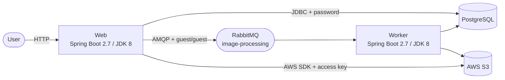
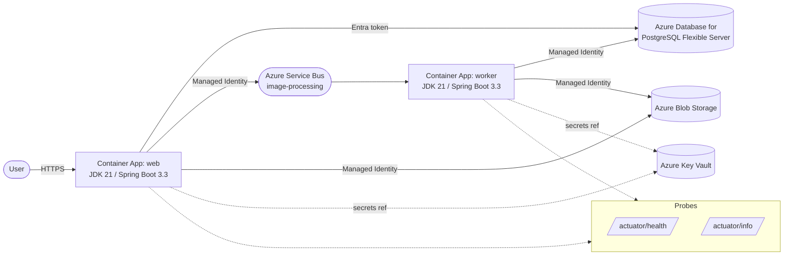

# Phase 7 — Architecture (Java)

## Legacy (before)

## Modernized (after)

## Migration map

| Legacy component | Modernized replacement |
|---|---|
| Tomcat (embedded) on Spring Boot 2.7 | Tomcat (embedded) on Spring Boot 3.3 |
| `javax.servlet.*` | `jakarta.servlet.*` |
| `javax.persistence.*` | `jakarta.persistence.*` |
| `WebMvcConfigurerAdapter` | `WebMvcConfigurer` (interface) |
| `HandlerInterceptorAdapter` | `HandlerInterceptor` (interface) |
| Hibernate 5 | Hibernate 6.5 |
| AWS S3 SDK v2 + access keys | Azure Storage Blob SDK + DefaultAzureCredential |
| RabbitMQ AMQP + guest password | Azure Service Bus + Managed Identity |
| PostgreSQL password | Azure Database for PostgreSQL Flexible Server + Entra token |
| `application.properties` secrets | Azure Key Vault (+ Spring Cloud Azure config source) |
| (none) | Spring Boot Actuator (`/actuator/health`, `/actuator/info`) |
| (none) | Multi-stage Dockerfile (`eclipse-temurin:21`) |
| (none) | Azure Container Apps |
