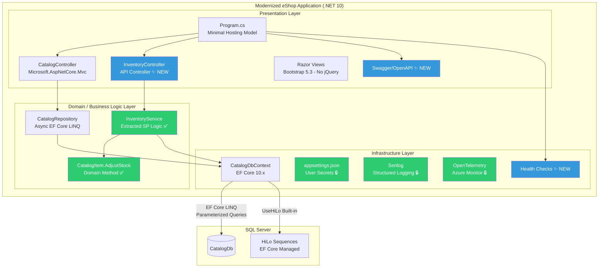
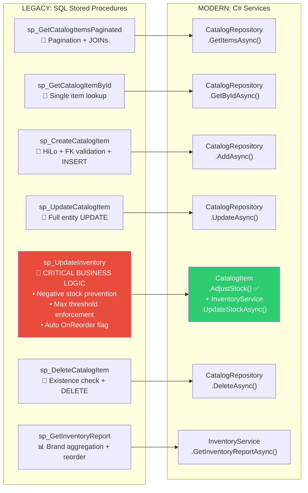
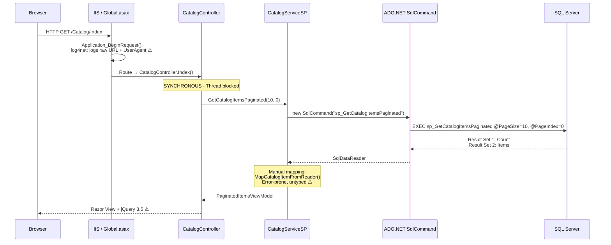
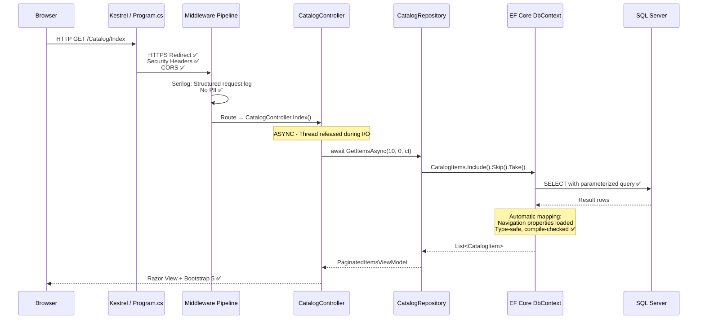
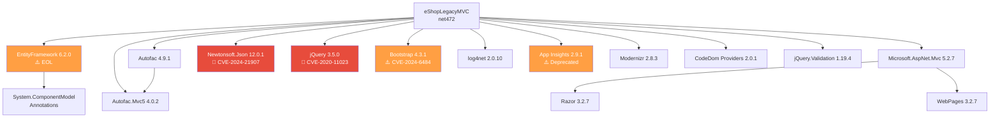
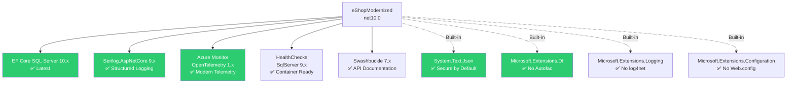
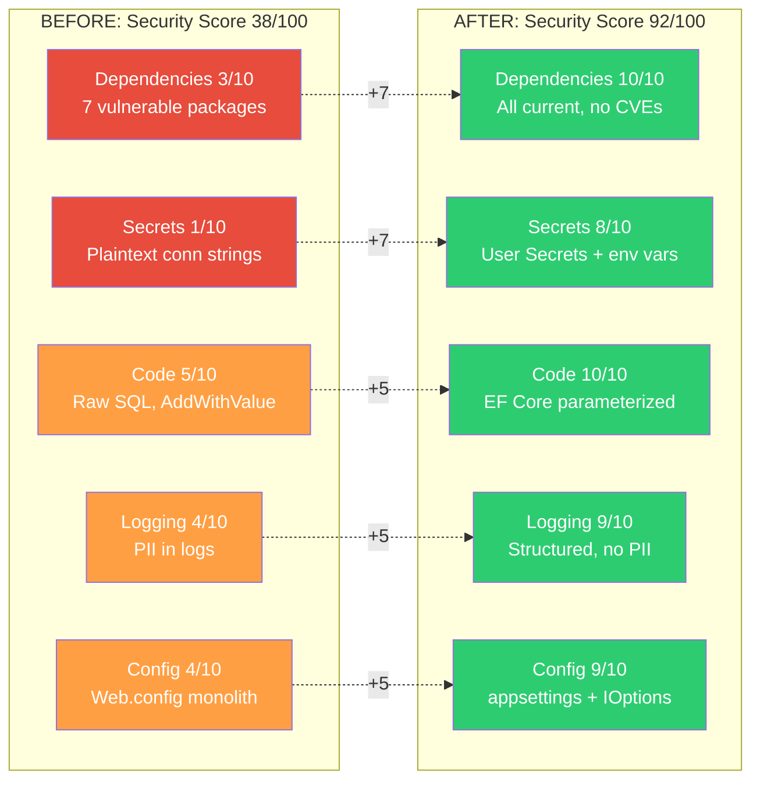
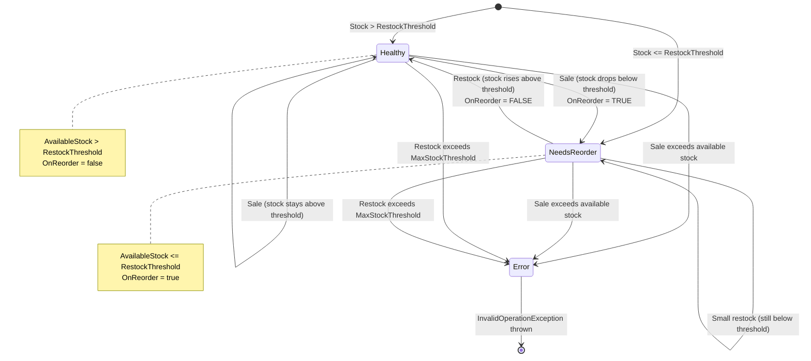
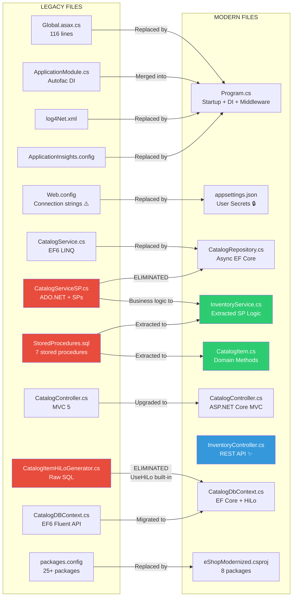

# Phase 7: Architecture Documentation — Before & After Modernization

## 1. High-Level Architecture Comparison

### 1.1 Legacy Architecture (.NET Framework 4.7.2)

```mermaid
graph TB
    subgraph "Legacy eShop MVC Application"
        subgraph "Presentation Layer"
            GA[Global.asax.cs<br/>Application Entry Point]
            RC[RouteConfig.cs]
            BC[BundleConfig.cs]
            FC[FilterConfig.cs]
            CC[CatalogController<br/>System.Web.Mvc]
            RV[Razor Views<br/>jQuery 3.5 + Bootstrap 4.3]
        end
        
        subgraph "Business Logic Layer"
            AM[ApplicationModule.cs<br/>Autofac DI Container]
            CS[CatalogService<br/>EF6 LINQ Queries]
            CSP[CatalogServiceSP<br/>Stored Procedure Calls]
            HiLo[CatalogItemHiLoGenerator<br/>Manual SQL Sequence]
        end
        
        subgraph "Data Access Layer"
            DBCtx[CatalogDBContext<br/>Entity Framework 6.2]
            WC[Web.config<br/>Connection Strings ⚠️]
            L4N[log4net<br/>File Logging ⚠️]
            AI[Application Insights 2.9<br/>Embedded Key ⚠️]
        end
    end
    
    subgraph "SQL Server"
        DB[(CatalogDb)]
        SP1[sp_GetCatalogItemsPaginated]
        SP2[sp_GetCatalogItemById]
        SP3[sp_CreateCatalogItem]
        SP4[sp_UpdateCatalogItem]
        SP5[sp_UpdateInventory<br/>⚠️ Business Logic in SQL]
        SP6[sp_DeleteCatalogItem]
        SP7[sp_GetInventoryReport]
        SEQ[HiLo Sequences x3]
    end
    
    GA --> RC & BC & FC
    CC --> CS & CSP
    CS --> DBCtx
    CSP -->|ADO.NET SqlCommand| SP1 & SP2 & SP3 & SP4 & SP5 & SP6 & SP7
    DBCtx --> DB
    HiLo -->|Raw SQL| SEQ
    AM --> CS & CSP
    
    style WC fill:#ff6b6b,color:#fff
    style AI fill:#ff6b6b,color:#fff
    style L4N fill:#ff9f43,color:#fff
    style SP5 fill:#ff9f43,color:#fff
    style HiLo fill:#ff9f43,color:#fff
```



### 1.2 Modernized Architecture (.NET 10)



---

## 2. Stored Procedure Migration Map



---

## 3. Data Flow — Request Processing

### 3.1 Legacy Flow (Synchronous, SP-based)



### 3.2 Modern Flow (Async, EF Core)



---

## 4. Dependency Graph — Before & After

### 4.1 Legacy Dependencies (25+ packages, net472)



### 4.2 Modern Dependencies (8 packages, net10.0)



---

## 5. Component Diagram — Modernized Application

```mermaid
graph TB
    subgraph "HTTP Layer"
        REQ[HTTP Request]
        HTTPS[HTTPS Redirect]
        HEADERS[Security Headers<br/>X-Content-Type-Options<br/>X-Frame-Options<br/>X-XSS-Protection]
    end
    
    subgraph "Controller Layer"
        CC[CatalogController<br/>MVC Views + CRUD]
        IC[InventoryController<br/>REST API]
    end
    
    subgraph "Service Layer"
        IS[IInventoryService<br/>→ InventoryService]
    end
    
    subgraph "Repository Layer"
        IR[ICatalogRepository<br/>→ CatalogRepository]
    end
    
    subgraph "Domain Layer"
        CI[CatalogItem<br/>.AdjustStock()]
        IUR[InventoryUpdateResult]
    end
    
    subgraph "Infrastructure"
        DB[CatalogDbContext<br/>EF Core 10.x]
        CFG[IOptions<CatalogSettings>]
        LOG[ILogger<T><br/>Serilog]
        HC[Health Checks]
    end
    
    subgraph "Data Store"
        SQL[(SQL Server)]
    end
    
    REQ --> HTTPS --> HEADERS --> CC & IC
    CC --> IR
    IC --> IS
    IS --> IR
    IS --> CI
    CI --> IUR
    IR --> DB
    DB --> SQL
    CC & IC -.-> LOG
    CC -.-> CFG
    DB -.-> HC
```

---

## 6. Security Posture Comparison



---

## 7. Inventory Business Logic — Domain Model Design



---

## 8. Migration File Mapping



---

## 9. Test Coverage Matrix

| Legacy Component | Stored Procedure | Modernized Component | Test Class | Test Count |
|---|---|---|---|---|
| `CatalogServiceSP.GetCatalogItemsPaginated` | `sp_GetCatalogItemsPaginated` | `CatalogRepository.GetItemsAsync` | `CatalogRepositoryTests` | 3 |
| `CatalogServiceSP.FindCatalogItem` | `sp_GetCatalogItemById` | `CatalogRepository.GetByIdAsync` | `CatalogRepositoryTests` | 2 |
| `CatalogServiceSP.CreateCatalogItem` | `sp_CreateCatalogItem` | `CatalogRepository.AddAsync` | `CatalogRepositoryTests` | 1 |
| `CatalogServiceSP.UpdateCatalogItem` | `sp_UpdateCatalogItem` | `CatalogRepository.UpdateAsync` | `CatalogRepositoryTests` | 1 |
| `CatalogServiceSP.RemoveCatalogItem` | `sp_DeleteCatalogItem` | `CatalogRepository.DeleteAsync` | `CatalogRepositoryTests` | 2 |
| `CatalogServiceSP.UpdateInventory` | `sp_UpdateInventory` | `CatalogItem.AdjustStock` | `CatalogItemInventoryTests` | 12 |
| `CatalogServiceSP.UpdateInventory` | `sp_UpdateInventory` | `InventoryService.UpdateStockAsync` | `InventoryServiceTests` | 5 |
| N/A | `sp_GetInventoryReport` | `InventoryService.GetInventoryReportAsync` | `InventoryServiceTests` | 3 |
| **Total** | **7 SPs** | **8 methods** | **3 test classes** | **29 tests** |

---

*Generated by HVE Core rpi-agent — Architecture documentation phase*
*All Mermaid diagrams render in VS Code Markdown Preview and GitHub*
*Documentation Date: March 5, 2026*
