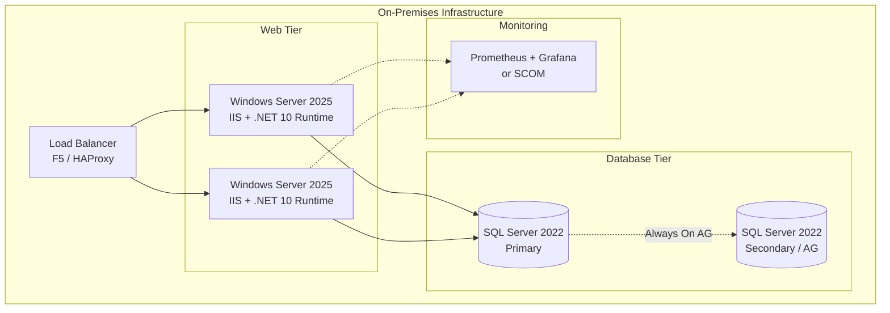
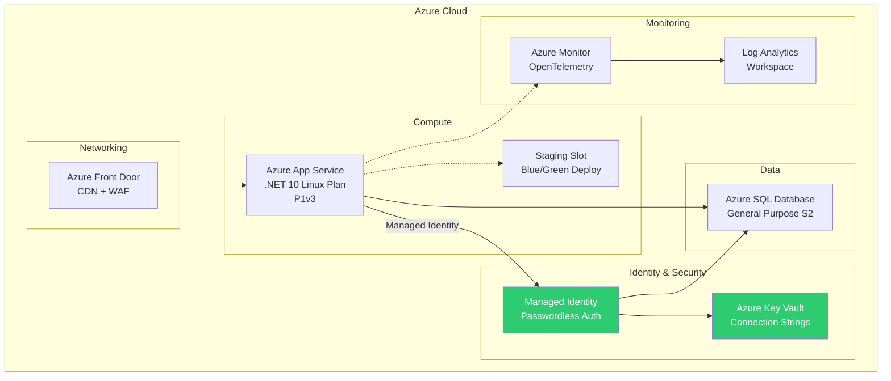
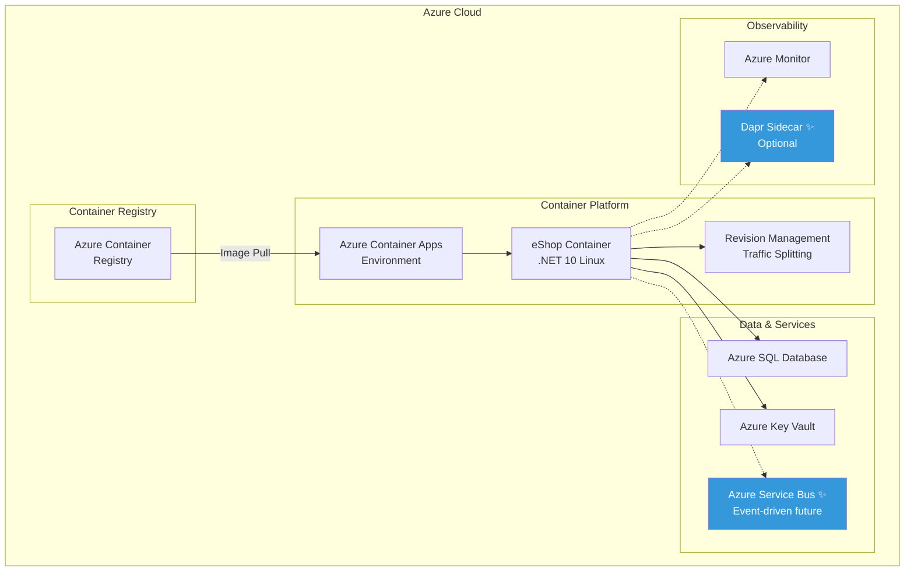
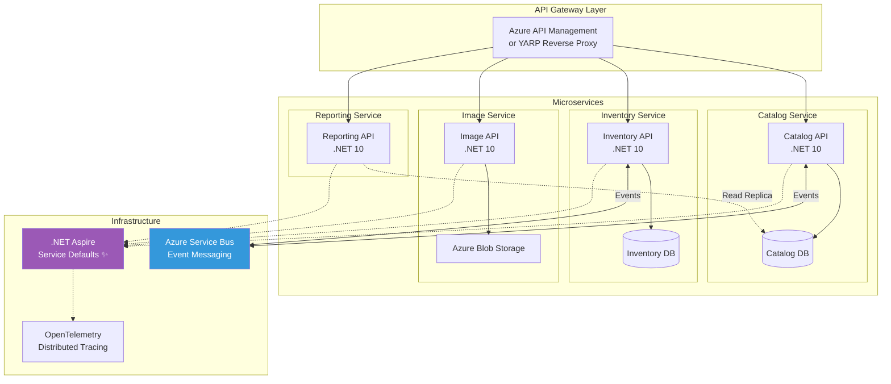
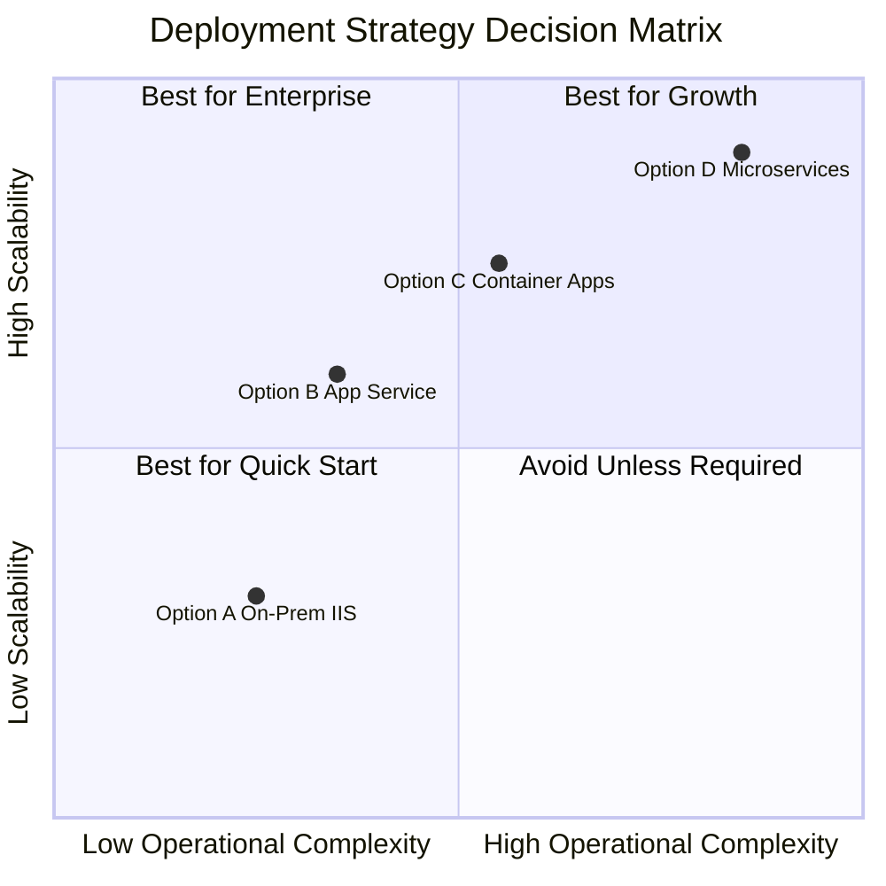
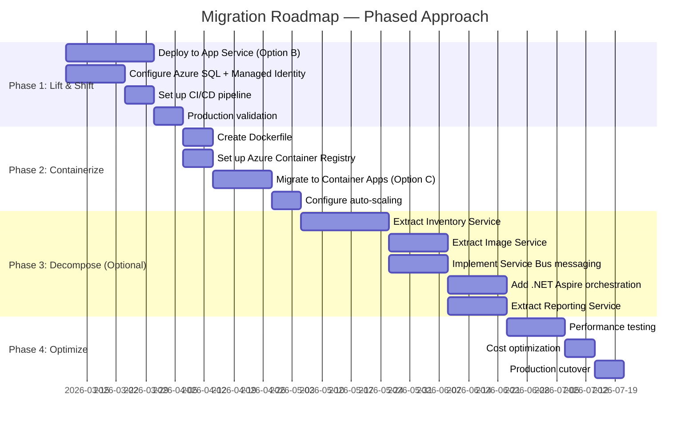

# Phase 8: Deployment & Migration Planning — PM Agent Report

## Executive Summary

This report evaluates four deployment strategies for the modernized eShop .NET 10 application, providing decision criteria, migration roadmaps, and cost frameworks for each option. The analysis considers both on-premises and Azure cloud deployments, with a special focus on microservices decomposition potential.

---

## Deployment Option Analysis

### Option A: On-Premises — IIS on Windows Server



| Attribute | Details |
|---|---|
| **Best For** | Organizations with existing Windows Server infrastructure, compliance requirements for data locality, or limited cloud readiness |
| **Deployment** | `dotnet publish -c Release -o ./publish` → Copy to IIS site → Configure app pool for .NET 10 |
| **CI/CD** | GitHub Actions / Azure DevOps → Build → Test → Deploy to IIS via WinRM or FTP |
| **Database** | SQL Server 2022 on-prem, Always On Availability Groups for HA |
| **Monitoring** | OpenTelemetry → Prometheus + Grafana, or SCOM |
| **Estimated Cost** | $15,000-25,000/yr (hardware amortization + licensing) |
| **Pros** | Full control, no cloud dependency, data stays local |
| **Cons** | Manual scaling, patch management burden, higher ops overhead |
| **Migration Effort** | Low (1-2 sprints) — straightforward IIS deployment |

---

### Option B: Azure App Service (PaaS)



| Attribute | Details |
|---|---|
| **Best For** | Teams wanting managed infrastructure, built-in scaling, and Azure ecosystem integration |
| **Deployment** | `az webapp deploy` or GitHub Actions → Azure App Service |
| **CI/CD** | GitHub Actions with `azure/webapps-deploy@v3` action, deployment slots for zero-downtime |
| **Database** | Azure SQL Database (General Purpose tier) with Managed Identity auth (passwordless) |
| **Monitoring** | Azure Monitor + OpenTelemetry (already configured in modernized app) |
| **Estimated Cost** | $300-600/mo (App Service P1v3 + Azure SQL S2 + monitoring) |
| **Pros** | Managed patching, auto-scale, deployment slots, built-in auth |
| **Cons** | Vendor lock-in, less control over infrastructure |
| **Migration Effort** | Low-Medium (2-3 sprints) — add Managed Identity, Key Vault, deploy |

**Key Azure Services:**
- Azure App Service (Linux, .NET 10)
- Azure SQL Database (serverless or provisioned)
- Azure Key Vault (secrets management)
- Azure Front Door (global load balancing + WAF)
- Azure Monitor (OpenTelemetry integration)
- Managed Identity (passwordless DB auth)

---

### Option C: Azure Container Apps (Containerized)



| Attribute | Details |
|---|---|
| **Best For** | Teams planning future microservice decomposition, needing container portability |
| **Deployment** | `docker build` → Azure Container Registry → Azure Container Apps revision |
| **CI/CD** | GitHub Actions → Build image → Push ACR → Deploy revision with traffic splitting |
| **Database** | Azure SQL Database with Managed Identity |
| **Monitoring** | Azure Monitor + OpenTelemetry + optional Dapr observability |
| **Estimated Cost** | $200-500/mo (Container Apps consumption + Azure SQL + ACR) |
| **Pros** | Container portability, Dapr integration, scale-to-zero, revision management |
| **Cons** | Requires Dockerfile knowledge, cold start latency on scale-to-zero |
| **Migration Effort** | Medium (3-4 sprints) — containerize, set up ACR, configure ACA |

**Dockerfile (for modernized app):**
```dockerfile
FROM mcr.microsoft.com/dotnet/aspnet:10.0 AS base
WORKDIR /app
EXPOSE 8080

FROM mcr.microsoft.com/dotnet/sdk:10.0 AS build
WORKDIR /src
COPY ["src/eShopModernized/eShopModernized.csproj", "src/eShopModernized/"]
RUN dotnet restore "src/eShopModernized/eShopModernized.csproj"
COPY . .
RUN dotnet publish "src/eShopModernized/eShopModernized.csproj" -c Release -o /app/publish

FROM base AS final
WORKDIR /app
COPY --from=build /app/publish .
ENTRYPOINT ["dotnet", "eShopModernized.dll"]
```

---

### Option D: Microservices Architecture



| Attribute | Details |
|---|---|
| **Best For** | Large teams, high-scale requirements, independent deployment needs |
| **Service Decomposition** | 4 services: Catalog, Inventory, Image, Reporting |
| **Communication** | Sync: REST/gRPC via API Gateway; Async: Azure Service Bus events |
| **Data Strategy** | Database-per-service pattern (separate schemas or databases) |
| **Monitoring** | .NET Aspire + OpenTelemetry distributed tracing across services |
| **Estimated Cost** | $800-2000/mo (4 container apps + 2 DBs + Service Bus + APIM) |
| **Pros** | Independent scaling, team autonomy, technology flexibility |
| **Cons** | Distributed system complexity, eventual consistency, operational overhead |
| **Migration Effort** | High (6-10 sprints) — decompose monolith, implement messaging, separate data |

**Service Boundaries (Domain-Driven Design):**

| Service | Bounded Context | Data Owned | APIs |
|---|---|---|---|
| **Catalog** | Product information | CatalogItem, CatalogBrand, CatalogType | CRUD for products, search, browse |
| **Inventory** | Stock management | AvailableStock, RestockThreshold, OnReorder | Stock adjustments, reorder alerts |
| **Image** | Product media | PictureFileName mapping to blob storage | Upload, retrieve, resize images |
| **Reporting** | Business analytics | Read-only view of catalog + inventory | Inventory reports, sales analytics |

---

## Decision Matrix



| Criteria | A: On-Prem | B: App Service | C: Containers | D: Microservices |
|---|---|---|---|---|
| **Time to Deploy** | 1-2 sprints | 2-3 sprints | 3-4 sprints | 6-10 sprints |
| **Monthly Cost** | $1,250/mo* | $300-600/mo | $200-500/mo | $800-2,000/mo |
| **Scalability** | Manual | Auto (1-30 instances) | Auto (0-N, scale to zero) | Per-service auto-scale |
| **Ops Burden** | High (OS patching, certs) | Low (managed) | Medium (containers) | High (distributed system) |
| **Team Size Needed** | 1-2 ops + 2-3 dev | 2-3 dev | 3-4 dev + 1 DevOps | 4-6 dev + 2 DevOps |
| **Lock-in Risk** | None | Medium (Azure) | Low (containers portable) | Medium (Azure services) |
| **Future-Proof** | ⭐⭐ | ⭐⭐⭐ | ⭐⭐⭐⭐ | ⭐⭐⭐⭐⭐ |

*\* On-prem cost = hardware amortization ($15-25k/yr ÷ 12)*

---

## Recommended Migration Roadmap

### Phased Approach (Recommended)



### Sprint-by-Sprint Plan

| Sprint | Duration | Activities | Deliverable |
|---|---|---|---|
| **Sprint 1** | 2 weeks | Deploy modernized monolith to Azure App Service, configure Azure SQL, set up Managed Identity | Working app on Azure |
| **Sprint 2** | 2 weeks | CI/CD pipeline (GitHub Actions), deployment slots, blue/green deploy | Automated deployment |
| **Sprint 3** | 2 weeks | Observability: Azure Monitor + OpenTelemetry dashboards, alerts | Full monitoring |
| **Sprint 4** | 2 weeks | Containerization: Dockerfile, ACR, migrate to Container Apps | Container-based deployment |
| **Sprint 5** | 2 weeks | Auto-scaling rules, performance baseline testing | Scalable infrastructure |
| **Sprint 6** | 2 weeks | (Optional) Extract Inventory as separate microservice | First microservice |
| **Sprint 7** | 2 weeks | (Optional) Service Bus integration, event-driven inventory updates | Async messaging |
| **Sprint 8** | 2 weeks | (Optional) Extract Image service → Azure Blob Storage | Media microservice |

---

## Cost Estimation Framework

### Azure Monthly Cost (Option B → C progression)

```
Phase 1: App Service Deployment
├── App Service P1v3 (Linux)        $138/mo
├── Azure SQL General Purpose (2 vCores) $200/mo
├── Azure Key Vault                 $0.03/10,000 ops
├── Azure Monitor (5GB logs)        $12/mo
├── Azure Front Door (Standard)     $35/mo
└── TOTAL                           ~$385/mo

Phase 2: Container Apps Deployment  
├── Container Apps (consumption)    $50-150/mo (scale to zero)
├── Azure Container Registry        $5/mo (Basic)
├── Azure SQL (unchanged)           $200/mo
├── Azure Monitor (unchanged)       $12/mo
└── TOTAL                           ~$267-367/mo

Phase 3: Microservices (4 services)
├── Container Apps (4 services)     $150-400/mo
├── Azure SQL (2 databases)         $400/mo
├── Azure Blob Storage              $5/mo
├── Azure Service Bus (Standard)    $10/mo
├── API Management (Developer)      $50/mo
├── Azure Monitor (10GB logs)       $24/mo
└── TOTAL                           ~$639-889/mo
```

---

## .NET Aspire Integration (For Options C & D)

If the customer chooses containerized or microservice deployment, add .NET Aspire for:

```csharp
// AppHost/Program.cs
var builder = DistributedApplication.CreateBuilder(args);

var sql = builder.AddSqlServer("sql")
    .AddDatabase("catalogdb");

var catalog = builder.AddProject<Projects.eShopModernized>("catalog")
    .WithReference(sql)
    .WithExternalHttpEndpoints();

builder.Build().Run();
```

**Benefits:**
- Service discovery and configuration
- Health check aggregation
- OpenTelemetry auto-configuration
- Local development orchestration
- Dashboard for all services

---

## PM Recommendations

1. **Start with Option B (App Service)** — lowest risk, fastest time to production
2. **Evolve to Option C (Container Apps)** when scaling requirements emerge
3. **Consider Option D (Microservices)** only if team grows to 8+ and independent deployment is required
4. **Avoid Option A (On-Prem)** unless regulatory/compliance mandates data locality

**Key Decision Points:**
- If < 3 dev team → Stay with Option B
- If need scale-to-zero → Move to Option C
- If 4+ teams need independent deploys → Consider Option D
- If data sovereignty required → Option A or Azure Government

---

*Generated by PM Migration Agent — Deployment planning phase*
*Uses HVE Core rpi-agent methodology*
*Planning Date: March 5, 2026*
